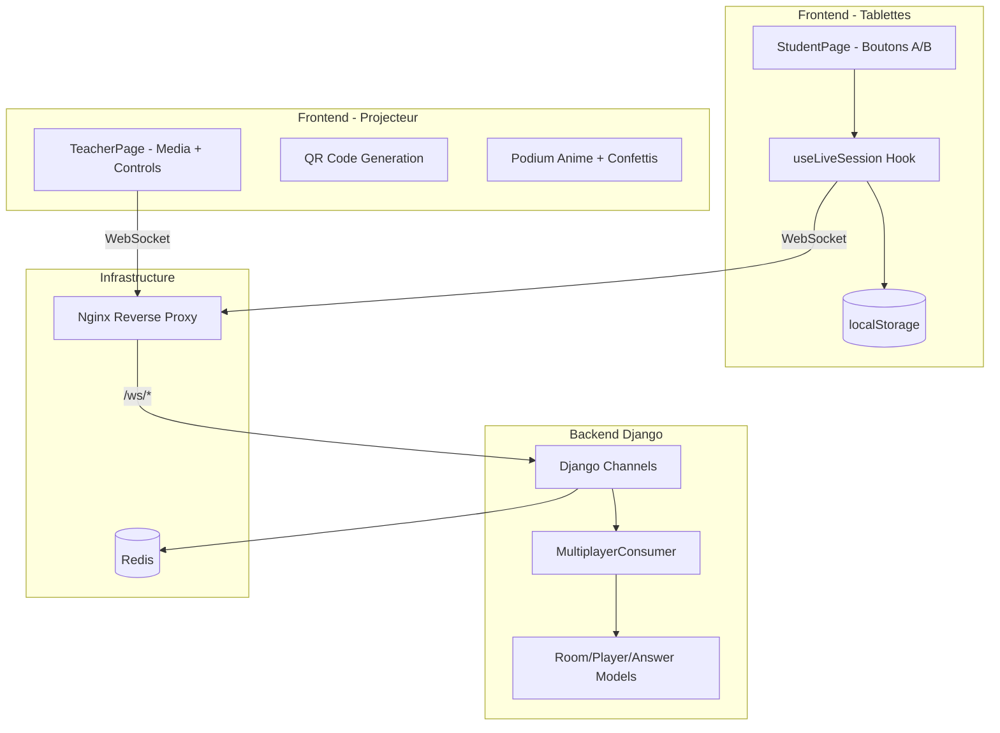
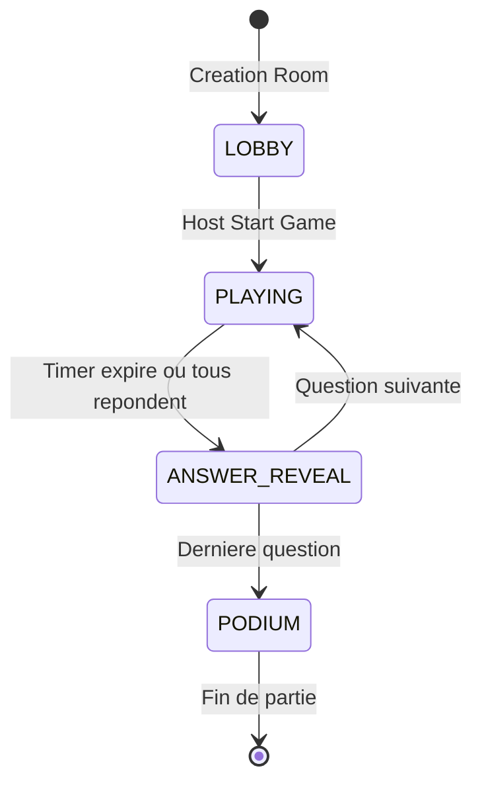

# Mode Live pour Classe - Plan d'Implementation

## Contexte Actuel

Le projet dispose deja d'une base WebSocket avec un `MultiplayerConsumer` dans [`backend/apps/game/consumers.py`](backend/apps/game/consumers.py), mais plusieurs elements sont manquants :

- Modeles `MultiplayerRoom`, `MultiplayerPlayer`, `MultiplayerAnswer`
- Configuration Django Channels + Redis
- Routes React pour le mode multiplayer
- Configuration Nginx pour WebSocket

## Architecture Cible




## Flux des Etats de la Room



---

## Phase 1 : Infrastructure Backend

### 1.1 Ajouter les dependances Django Channels

Modifier [`backend/requirements.txt`](backend/requirements.txt) :

```javascript
channels==4.0.0
channels-redis==4.2.0
daphne==4.1.0
```


### 1.2 Creer les modeles Multiplayer

Ajouter dans [`backend/apps/game/models.py`](backend/apps/game/models.py) les modeles :

- `MultiplayerRoom` : room_code, quiz, status, current_pair_index, ai_positions (JSON), created_at
- `MultiplayerPlayer` : room (FK), pseudo, score, channel_name, session_token, is_connected, joined_at
- `MultiplayerAnswer` : player (FK), media_pair (FK), choice, is_correct, points_earned, response_time_ms, answer_order

### 1.3 Configurer Django Channels avec Redis

Modifier [`backend/config/settings.py`](backend/config/settings.py) :

- Ajouter `channels` et `daphne` aux INSTALLED_APPS
- Configurer ASGI_APPLICATION et CHANNEL_LAYERS avec Redis

### 1.4 Ajouter un endpoint pour generer le session_token

Ajouter dans [`backend/apps/game/views.py`](backend/apps/game/views.py) un endpoint pour la creation de room qui retourne aussi un `session_token` unique pour la reconnexion.---

## Phase 2 : Infrastructure Docker

### 2.1 Ajouter Redis au docker-compose

Modifier [`docker-compose.yml`](docker-compose.yml) pour ajouter le service Redis et mettre a jour le backend pour utiliser Daphne au lieu de runserver.

### 2.2 Configurer Nginx pour WebSocket

Modifier [`nginx/nginx.conf`](nginx/nginx.conf) pour router `/ws/` vers le backend Django avec les headers WebSocket (Upgrade, Connection).---

## Phase 3 : Hook React useLiveSession

### 3.1 Creer le hook avec persistance

Creer [`frontend/src/hooks/useLiveSession.ts`](frontend/src/hooks/useLiveSession.ts) :

- Sauvegarde du `session_token`, `pseudo`, `room_code` dans localStorage
- Detection automatique de reconnexion au chargement
- Restauration de l'etat (question en cours) apres refresh
- Blocage de la navigation vers d'autres pages

### 3.2 Adapter useMultiplayerSocket

Modifier [`frontend/src/hooks/useMultiplayerSocket.ts`](frontend/src/hooks/useMultiplayerSocket.ts) pour supporter la reconnexion via session_token.---

## Phase 4 : Composants React

### 4.1 Ajouter les routes multiplayer

Modifier [`frontend/src/App.tsx`](frontend/src/App.tsx) :

```tsx
<Route path="/multiplayer/host" element={<MultiplayerHostPage />} />
<Route path="/multiplayer/join/:roomCode?" element={<MultiplayerJoinPage />} />
<Route path="/multiplayer/play/:roomCode" element={<MultiplayerPlayerPage />} />
```


### 4.2 Modifier MultiplayerPlayerPage

Adapter [`frontend/src/pages/multiplayer/MultiplayerPlayerPage.tsx`](frontend/src/pages/multiplayer/MultiplayerPlayerPage.tsx) :

- Utiliser `useLiveSession` pour la persistance
- Afficher "Attente du resultat..." apres reponse
- Bloquer la navigation arriere

### 4.3 Modifier MultiplayerHostPage

Adapter [`frontend/src/pages/multiplayer/MultiplayerHostPage.tsx`](frontend/src/pages/multiplayer/MultiplayerHostPage.tsx) :

- Ajouter le QR Code (deja present avec qrcode.react)
- Implementer le podium anime avec Framer Motion et canvas-confetti

---

## Phase 5 : Podium Anime avec Confettis

### 5.1 Installer canvas-confetti

```bash
npm install canvas-confetti @types/canvas-confetti
```


### 5.2 Creer le composant Podium

Dans [`frontend/src/pages/multiplayer/MultiplayerHostPage.tsx`](frontend/src/pages/multiplayer/MultiplayerHostPage.tsx), ameliorer la section podium avec :

- Animation d'entree sequentielle (3eme, 2eme, 1er)
- Effet confettis au moment de l'affichage du 1er
- Barres animees avec hauteurs differentes

---

## Fichiers Principaux a Modifier/Creer

| Fichier | Action |

|---------|--------|

| `backend/requirements.txt` | Ajouter channels, channels-redis, daphne |

| `backend/apps/game/models.py` | Ajouter modeles Multiplayer |

| `backend/config/settings.py` | Config Channels + Redis |

| `docker-compose.yml` | Ajouter Redis, modifier backend cmd |

| `nginx/nginx.conf` | Route WebSocket /ws/ |

| `frontend/src/hooks/useLiveSession.ts` | Nouveau hook persistance |

| `frontend/src/App.tsx` | Routes multiplayer |

| `frontend/src/pages/multiplayer/MultiplayerHostPage.tsx` | Podium + confettis |