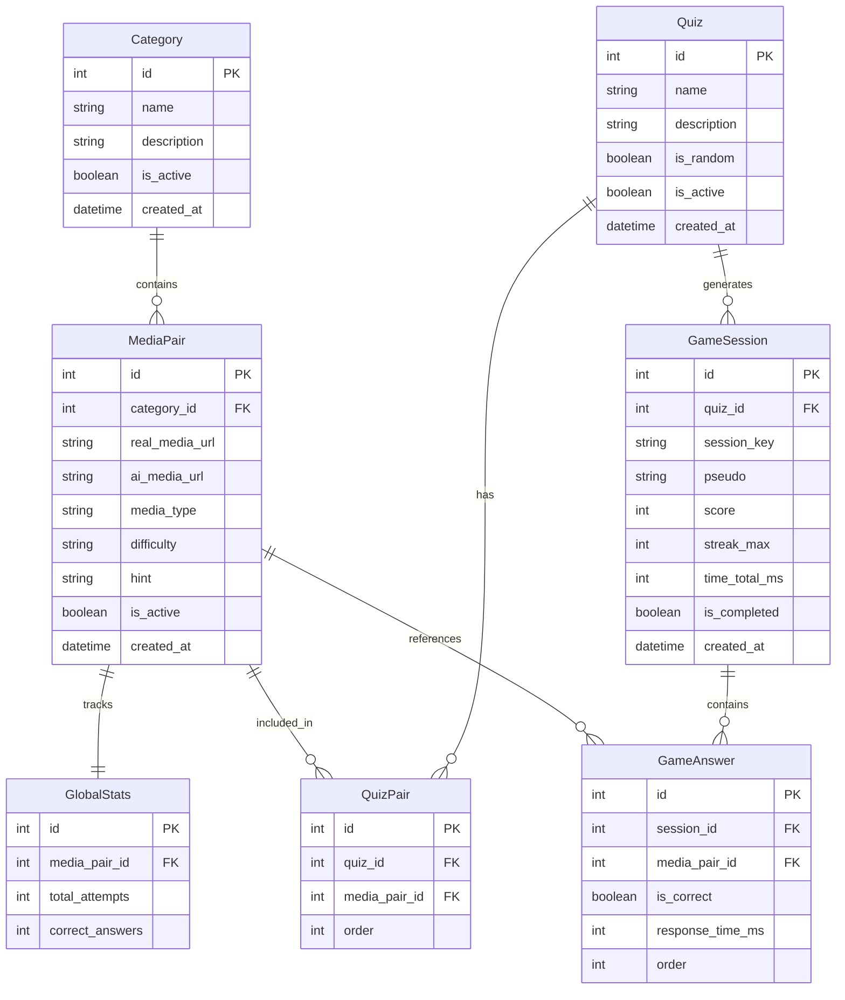
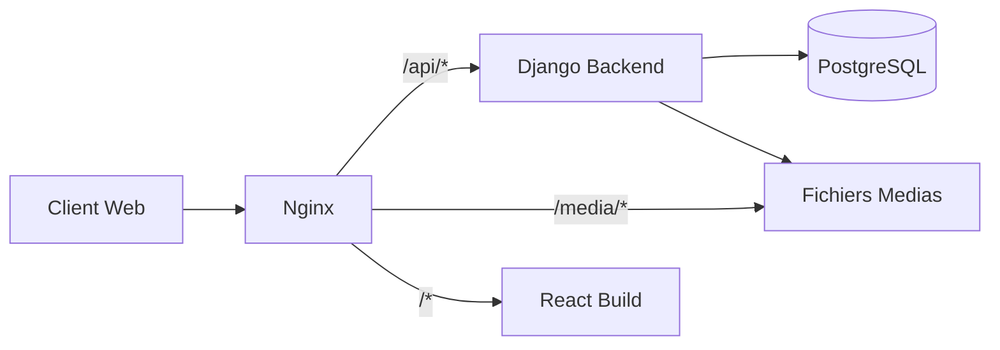

<!-- c1d03318-487b-460e-a55c-b3dae4db2378 cbee54de-65c5-4d17-baed-e84742a54bfd -->
# Architecture WebApp "Real vs AI"

## Structure du Projet

```
WebApp/
├── docker-compose.yml
├── .env.example
├── backend/
│   ├── Dockerfile
│   ├── requirements.txt
│   ├── manage.py
│   ├── config/
│   │   ├── settings.py
│   │   ├── urls.py
│   │   └── wsgi.py
│   ├── apps/
│   │   ├── game/
│   │   │   ├── models.py
│   │   │   ├── views.py
│   │   │   ├── serializers.py
│   │   │   └── urls.py
│   │   └── admin_api/
│   │       ├── views.py
│   │       ├── serializers.py
│   │       └── urls.py
│   └── media/
│       └── pairs/
├── frontend/
│   ├── Dockerfile
│   ├── package.json
│   ├── src/
│   │   ├── components/
│   │   ├── pages/
│   │   ├── hooks/
│   │   ├── services/
│   │   └── styles/
└── nginx/
    ├── Dockerfile
    └── nginx.conf
```

## Modeles Django



### Modeles detailles

**Category** : Categories thematiques (Paysages, Portraits, Animaux...)

**MediaPair** : Paire de medias (reel + IA)

- `media_type`: "image" ou "video"
- `difficulty`: "easy", "medium", "hard"
- `hint`: Explication post-reponse

**Quiz** : Questionnaire personnalise

- `is_random`: Si true, pioche aleatoirement dans les paires

**GameSession** : Session de jeu d'un utilisateur

- `streak_max`: Plus longue serie de bonnes reponses
- `time_total_ms`: Temps total de jeu

**GlobalStats** : Statistiques par paire pour afficher "X% ont trouve"

## Endpoints API

### API Publique (Jeu)

| Methode | Endpoint | Description |

|---------|----------|-------------|

| GET | `/api/game/quizzes/` | Liste des quiz disponibles |

| POST | `/api/game/sessions/` | Demarre une session (retourne 10 paires) |

| POST | `/api/game/sessions/{id}/answer/` | Soumet une reponse |

| GET | `/api/game/sessions/{id}/result/` | Resultat final + stats |

| GET | `/api/game/leaderboard/` | Classement (filtrable par quiz) |

| POST | `/api/game/leaderboard/` | Enregistre pseudo + score |

### API Admin (Interface React)

| Methode | Endpoint | Description |

|---------|----------|-------------|

| GET/POST | `/api/admin/categories/` | CRUD categories |

| GET/POST | `/api/admin/media-pairs/` | CRUD paires de medias |

| POST | `/api/admin/media-pairs/upload/` | Upload fichiers medias |

| GET/POST | `/api/admin/quizzes/` | CRUD quiz |

| GET | `/api/admin/stats/` | Dashboard statistiques |

## Composants React

```mermaid
flowchart TB
    subgraph pages [Pages]
        Home[HomePage]
        Game[GamePage]
        Result[ResultPage]
        Leaderboard[LeaderboardPage]
        AdminDashboard[AdminDashboard]
        AdminPairs[AdminMediaPairs]
        AdminQuizzes[AdminQuizzes]
    end
    
    subgraph components [Composants]
        MediaDisplay[MediaDisplay]
        Timer[Timer]
        ProgressBar[ProgressBar]
        StreakIndicator[StreakIndicator]
        ScoreCard[ScoreCard]
        Confetti[ConfettiEffect]
        FeedbackOverlay[FeedbackOverlay]
        QuizSelector[QuizSelector]
        PseudoInput[PseudoInput]
    end
    
    subgraph admin [Composants Admin]
        MediaUploader[MediaUploader]
        PairEditor[PairEditor]
        QuizBuilder[QuizBuilder]
        StatsChart[StatsChart]
    end
    
    Game --> MediaDisplay
    Game --> Timer
    Game --> ProgressBar
    Game --> StreakIndicator
    Game --> FeedbackOverlay
    Result --> ScoreCard
    Result --> Confetti
    Result --> PseudoInput
    Home --> QuizSelector
    AdminPairs --> MediaUploader
    AdminPairs --> PairEditor
    AdminQuizzes --> QuizBuilder
    AdminDashboard --> StatsChart
```



### Bibliotheques Frontend

- **React Router** : Navigation
- **Framer Motion** : Animations (swipe, transitions, feedback)
- **canvas-confetti** : Effet confettis
- **Axios** : Requetes API
- **TailwindCSS** : Styling
- **React Query** : Cache et gestion d'etat serveur
- **Recharts** : Graphiques pour l'admin

## Configuration Docker

### docker-compose.yml

Services :

- **db** : PostgreSQL 15
- **backend** : Django + Gunicorn
- **frontend** : Node pour build, servi par Nginx
- **nginx** : Reverse proxy + fichiers statiques/medias

### Flux reseau



## Logique de Jeu

### Demarrage de session

1. L'utilisateur choisit un quiz (ou mode aleatoire)
2. Le backend genere une session avec 10 paires
3. Retourne les paires dans l'ordre (ou aleatoire si `is_random`)

### Soumission de reponse

1. L'utilisateur clique sur le media qu'il pense reel
2. Envoi : `{pair_id, choice: "left"|"right", response_time_ms}`
3. Backend retourne : `{is_correct, hint, global_stats, current_streak}`
4. Frontend affiche feedback + animation

### Calcul du score

- Base : 100 points par bonne reponse
- Streak bonus : +10 points par reponse consecutive (max +50)
- Time bonus : Points supplementaires si reponse < 5 secondes
- Score final = somme des points

## Phases d'Implementation

### Phase 1 : Infrastructure

- Configuration Docker Compose
- Setup Django + DRF
- Setup React + Vite + TailwindCSS
- Configuration Nginx

### Phase 2 : Backend Core

- Modeles Django
- API publique (jeu)
- API admin (CRUD)
- Upload de medias

### Phase 3 : Frontend Jeu

- Pages principales (Home, Game, Result)
- Composants de jeu (MediaDisplay, Timer, ProgressBar)
- Animations et feedback
- Leaderboard

### Phase 4 : Interface Admin

- Dashboard avec statistiques
- Gestion des paires de medias
- Creation de quiz
- Upload de fichiers

### Phase 5 : Polish

- Animations avancees (Framer Motion)
- Confettis et effets visuels
- Optimisation des performances
- Tests et corrections

### To-dos

- [ ] Configuration Docker Compose (PostgreSQL, Django, React, Nginx)
- [ ] Setup Django + DRF avec structure du projet
- [ ] Creation des modeles Django (Category, MediaPair, Quiz, GameSession, etc.)
- [ ] Implementation API publique (sessions, answers, leaderboard)
- [ ] Implementation API admin (CRUD categories, paires, quiz)
- [ ] Setup React + Vite + TailwindCSS + Framer Motion
- [ ] Pages principales (Home, Game, Result, Leaderboard)
- [ ] Composants de jeu (MediaDisplay, Timer, ProgressBar, Feedback)
- [ ] Animations (swipe, feedback vert/rouge, confettis)
- [ ] Interface admin React (Dashboard, MediaPairs, Quizzes)
- [ ] Configuration Nginx (reverse proxy, fichiers statiques)